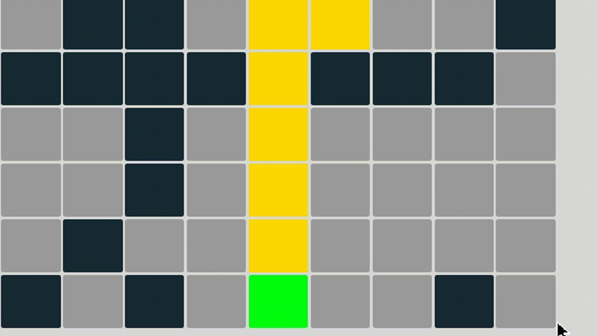

# Q-Learning Visualizer

This visualizer is for experiencing the Q-Learning algorithm. Q-Learning algorithm is a model-free reinforcement learning algorithm. In this case the agent learns that how to solve the maze which generated randomly, also you can add walls and design a maze.

### Using
You can experience this project by the GitHub Pages! Just click https://i01000101.github.io/Q-Learning-Visualizer/

You can see the Q values of the cells by hovering over the cells with mouse after adequate training.

You can set how many seconds the agent stays in a cell but if you don't make it zero you probably won't see the result and the shortest path, so make it zero at some point.

After one adequate training you can change the starting point and make the episode goal zero, agent find shortest path from there to the goal point. Becareful! Agent will need to be retrained if you add or remove wall or change the goal point because the maze is no longer the old maze.

